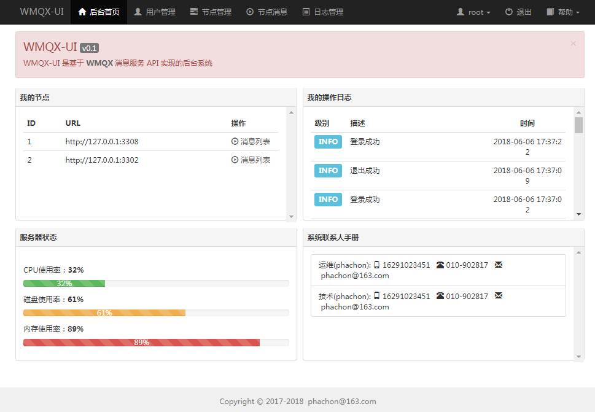

# WMQX-UI

[](https://github.com/phachon/wmqx-ui/) 
[](https://raw.githubusercontent.com/phachon/wmqx-ui/master/LICENSE)
[]()
[](https://github.com/phachon/wmqx-ui/releases) 
[](https://github.com/phachon/wmqx-ui/releases) 

[](https://github.com/phachon/wmqx)

WMQX-UI 是根据 WMQX Manager Api 构建的后台管理系统，如果您还不了解 WMQX，点击查看 [WMQX](https://github.com/phachon/wmqx)

## 安装

### 软件依赖
- mysql 5.5.*

### 下载 WMQX-UI

下载最新版本的二进制程序，[https://github.com/phachon/wmqx-ui/releases](https://github.com/phachon/wmqx-ui/releases)

```shell
# 解压
$ tar -zxvf wmqx-ui-linux_amd64.tar.gz
```

### 创建数据库
```
# 进入解压后根目录下 db, 执行下面命令（如果提示 mysql 找不到，请将 mysql 加入环境变量）
mysql -u root -padmin -e "source wmqx-mysql.sql"
# root 为 mysql 账号，admin 为 mysql 密码
```

### 修改配置文件

```shell
$ cp conf/default conf/wmqx-ui.conf
```

```shell
# 监听的端口
httpport = 8081
# 修改数据库连接信息
[db]
host="127.0.0.1"
port="3306"
name="wmqx"
user="root"
pass="admin"
table_prefix="wmqx_"
conn_max_idle=30
conn_max_connection=200
```

### 启动程序
```
./wmqx-ui
# 你也可以指定配置文件启动
./wmqx-ui --conf conf/wmqx-ui.conf
```

## 使用

### 登录
默认账号密码是 root, 123456。角色为超级管理员

### 后台预览
[]()

### 节点
这里的节点指的是 WMQX 服务，没有节点，请先安装 [WMQX](https://github.com/phachon/wmqx).

节点的相关信息请查看 [WMQX配置文件](https://github.com/phachon/wmqx/wiki/config_toml)

### 节点消息
节点消息即 WMQX 服务的 message, 查看 [message api](https://github.com/phachon/wmqx/wiki/message)

## 反馈

- 如果您喜欢该项目，请 [Start](https://github.com/phachon/wmqx-ui/stargazers).
- 如果在使用过程中有任何问题， 请提交 [Issue](https://github.com/phachon/wmqx-ui/issues).
- 如果您发现并解决了bug，请提交 [Pull Request](https://github.com/phachon/wmqx-ui/pulls).
- 如果您想二次开发，欢迎 [Fork](https://github.com/phachon/wmqx-ui/network/members).
- 如果你想交个朋友，欢迎发邮件给 [phachon@163.com](mailto:phachon@163.com).

## License

MIT

Thanks
---------
Create By phachon@163.com